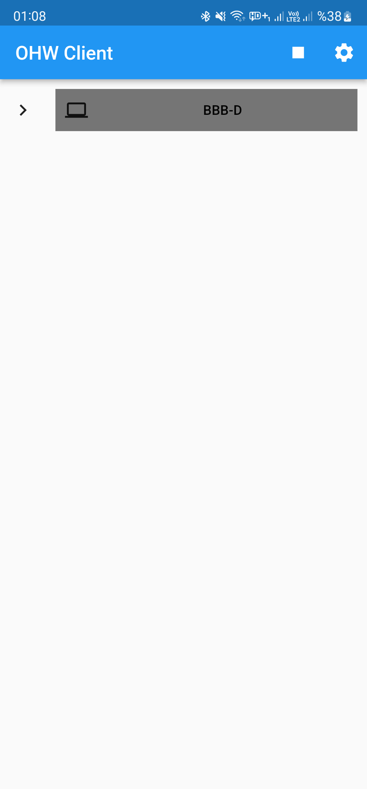
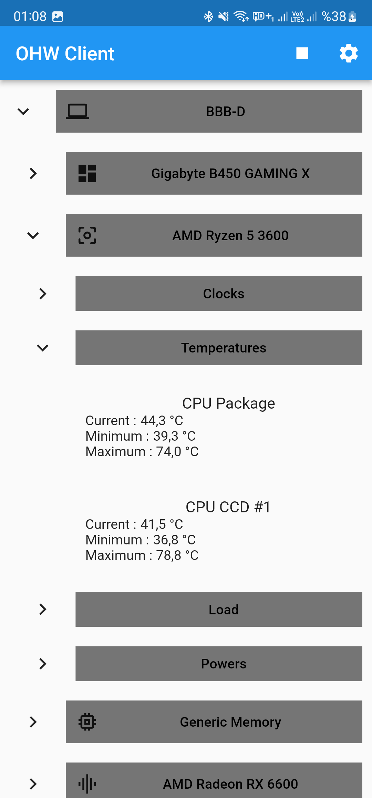
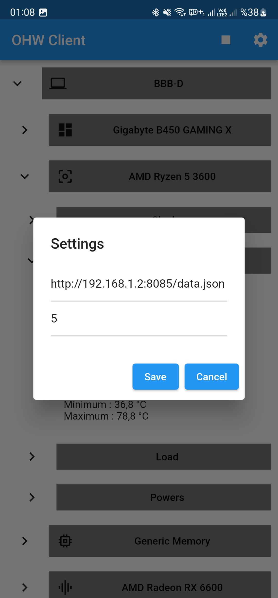

# Open Hardware Monitor Client

Open Hardware Monitor Client app is open-source Open Hardware Monitor app for Android, Ios. It is built with Dart on top of Google's Flutter Framework.


## Installing OpenHardwareMonitor

OpenHardwareMonitor is completely free and open source and supports most hardware chips found on todays computers. To install it on your host machine, open https://openhardwaremonitor.org/.

- Click Download Open Hardware Monitor
- In the next window, click Download Now
- Open the ZIP file and extract it
- In the folder, you will find a few files one of which is OpenHardwareMonitor.exe
- Right-click and run it as an Administrator
- This will open the application and we can continue to configure it:

## Configuring OpenHardwareMonitor
In the the app, you will immediately see a list of hardware your system is running on. These are expanded from a collapsible list and organized into categories: motherboard, processor, memory, graphics card and storage.

From the menu of Open Hardware Monitor, we want to change a few things:

From the Options tab, enable the following
- Start Minimized
- Minimize to Tray
- Minimize on Close
- Run on Windows Startup
- Change the Temperature unit if you need to (°C or °F)
- Click Remote Web Server and select Run


### Windows 
- On Windows, Press the Windows + R key
- Input ```control firewall.cpl```
- Alternatively, open Windows Defender Firewall from Control Panel
- From the side menu, click Advanced settings
- This will open a new window:
- Windows Defender Firewall with Advanced Security
- On the left side pane, select Inbound Rules right-click and click New Rule….
- Select Port from the menu
- Select TCP and specify port 8085
- Select Allow the connection
- Select Private Network Type
- And Save it :)

### Linux
```
sudo firewall-cmd --permanent --add-port=8085/tcp
sudo firewall-cmd --reload
```


| Screenshot 1                              | Screenshot 2                              | Screenshot 3                              |
|-------------------------------------------|-------------------------------------------|-------------------------------------------|
|  |  |  |


## Dependencies 💤 - `flutter_simple_treeview:` - - `dio:` - - `provider:` - - `shared_preferences:`